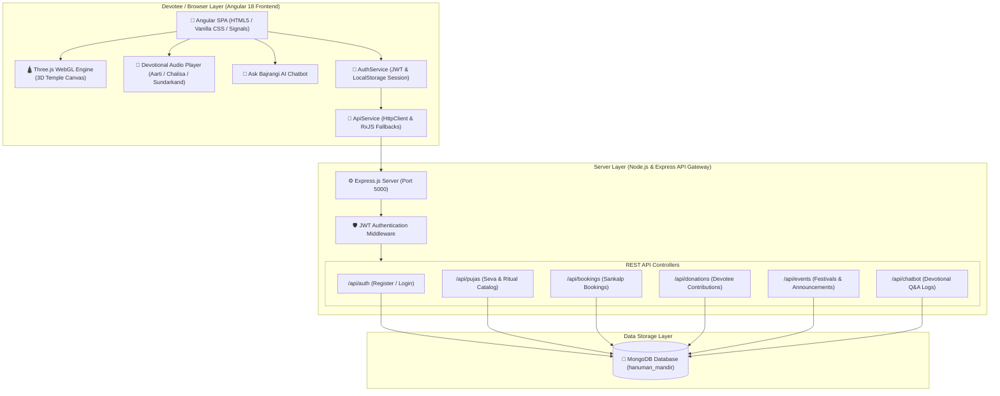

# 🚩 Shree Bajrangbali Temple Portal

A modern, full-stack **MEAN (MongoDB, Express.js, Angular, Node.js)** web platform built with **Three.js 3D WebGL Graphics**, interactive devotional audio players, live virtual darshan, online Puja & Seva bookings, devotee user authentication, and an AI spiritual assistant (*Ask Bajrangi*).

---

## 📐 System Architecture Diagram



---

## 📂 Complete File & Directory Structural Diagram

```
Temple Website/
├── 📄 README.md                             # Comprehensive System Documentation & Architecture
│
├── 📁 backend/                              # Express REST API Server
│   ├── 📄 server.js                         # Server Entry Point, CORS, Rate Limits & Mongo Connect
│   ├── 📄 package.json                      # Backend Dependencies (Express, Mongoose, JWT, Bcrypt)
│   ├── 📄 package-lock.json                 # Dependency Lockfile
│   ├── 📄 .env                              # Environment Variables (PORT, MONGO_URI, JWT_SECRET)
│   │
│   ├── 📁 middleware/                       # Middleware Modules
│   │   └── 📄 auth.js                       # JWT Authorization Token Verification
│   │
│   ├── 📁 models/                           # Mongoose Database Schemas
│   │   ├── 📄 User.js                       # Devotee Profile (Name, Email, Mobile, Password, Role)
│   │   ├── 📄 Puja.js                       # Pooja Offering Schema (Title, Price, Duration, Tag)
│   │   ├── 📄 Booking.js                    # Sankalp Booking Schema (Name, Gotra, Date, Address)
│   │   ├── 📄 Donation.js                   # Devotee Contribution Schema (Amount, Seva, PaymentRef)
│   │   ├── 📄 Event.js                      # Temple Festival & Event Announcement Schema
│   │   ├── 📄 Gallery.js                    # Temple Photo & Shringar Album Schema
│   │   ├── 📄 Announcement.js               # Urgent Notice Banner Schema
│   │   ├── 📄 ChatLog.js                    # AI Chatbot Question & Resolution Schema
│   │   ├── 📄 Contact.js                    # Devotee Inquiry & Message Schema
│   │   └── 📄 Prayer.js                     # Public Devotee Prayer Request Schema
│   │
│   └── 📁 routes/                           # Express Controllers & Endpoints
│       └── 📄 api.js                        # Auth, Pujas, Bookings, Donations & Seeder Endpoints
│
└── 📁 frontend/                             # Angular 18 Single Page Application (SPA)
    ├── 📄 package.json                      # Frontend Dependencies (Three.js, RxJS, Angular Core)
    ├── 📄 package-lock.json                  # Dependency Lockfile
    ├── 📄 angular.json                      # Angular CLI Workspace Configuration
    ├── 📄 tsconfig.json                     # TypeScript Compiler Options
    │
    └── 📁 src/                              # Source Code
        ├── 📄 main.ts                       # Angular Application Bootstrap Entry Point
        ├── 📄 index.html                    # Root HTML Container & Font Imports
        ├── 📄 styles.css                    # Global CSS Tokens, Theme Variables & Dark Mode Rules
        │
        └── 📁 app/                          # Core Application Code
            ├── 📄 app.ts                    # Main App Root Component Shell
            ├── 📄 app.html                  # Main Layout Template (Navbar + Router Outlet + Footer)
            ├── 📄 app.css                   # Global Layout Rules & Animations
            ├── 📄 app.routes.ts             # SPA Navigation Routes Map
            ├── 📄 app.config.ts             # Application Providers (HttpClient, Router Config)
            │
            ├── 📁 core/                     # Core Auth & Interceptor Guards
            │   ├── 📄 auth.service.ts       # Devotee Auth Signal State & LocalStorage Fallback
            │   ├── 📄 auth.guard.ts         # Angular Route Guard for Protected Dashboard Routes
            │   └── 📄 auth.interceptor.ts   # HTTP Request Interceptor Injecting Bearer Tokens
            │
            ├── 📁 services/                 # Global Application Services
            │   ├── 📄 api.service.ts        # Backend HTTP REST API Service
            │   ├── 📄 devotional-audio.service.ts # Centralized Web Audio Engine
            │   └── 📄 language.service.ts   # English / Hindi Bilingual Translation Signals
            │
            └── 📁 components/               # View Components
                ├── 📁 navbar/               # Header Navigation Bar
                │   ├── 📄 navbar.ts         # Navigation Logic, User State & Dark Toggle
                │   ├── 📄 navbar.html       # Brand Logo, Menu Links & Actions
                │   └── 📄 navbar.css        # Responsive Glassmorphic Bar Styling
                │
                ├── 📁 footer/               # Footer Navigation & Info
                │   ├── 📄 footer.ts         # Timings & Quick Links Component
                │   ├── 📄 footer.html       # Darshan Schedule & Temple Location Map Link
                │   └── 📄 footer.css        # Deep Charcoal Footer Styles
                │
                ├── 📁 home/                 # Home Landing Page & 3D Scene
                │   ├── 📄 home.ts           # Home Controller & Interactive Features
                │   ├── 📄 temple-scene.ts   # Three.js 3D WebGL Scene, Dome, Diyas & Bells
                │   ├── 📄 home.html         # Hero Banner, 3D WebGL Canvas & Quick Sevas
                │   └── 📄 home.css          # Hero Layout & WebGL Container Styles
                │
                ├── 📁 services/             # Pooja & Seva Offerings Page
                │   ├── 📄 services.ts       # 8 Dedicated Lord Hanuman Pujas & Booking Handler
                │   ├── 📄 services.html     # Hanuman Puja Cards Grid & Sankalp Modal
                │   └── 📄 services.css      # Card Heights & Pixel-Perfect Grid Styles
                │
                ├── 📁 aarti/                # Daily Aarti Audio & Lyric Player
                │   ├── 📄 aarti.ts          # Aarti Player State & Track Selector
                │   ├── 📄 aarti.html        # Audio Controls & Synchronized Aarti Lyrics
                │   └── 📄 aarti.css         # Saffron Card Audio Player Styles
                │
                ├── 📁 chalisa/              # 40-Verse Hanuman Chalisa Interactive Player
                │   ├── 📄 chalisa.ts        # Verse Scroller & Translation Engine
                │   ├── 📄 chalisa.html      # Verse-by-Verse Hindi & English Translation Cards
                │   └── 📄 chalisa.css       # Illuminated Active Verse Styling
                │
                ├── 📁 sundarkand/           # Sundarkand Path Recitation Player
                │   ├── 📄 sundarkand.ts     # Chapter Audio Player Controller
                │   ├── 📄 sundarkand.html   # Sundarkand Verses & Audio Progress Scrubber
                │   └── 📄 sundarkand.css    # Parchment Paper Theme Styling
                │
                ├── 📁 live-darshan/         # Virtual Live Darshan & Schedule
                │   ├── 📄 live-darshan.ts   # Live Video Feed & Timings Controller
                │   ├── 📄 live-darshan.html # Live Darshan Screen & Aarti Timings Table
                │   └── 📄 live-darshan.css  # Cinema Mode Video Wrapper Styles
                │
                ├── 📁 chatbot/              # "Ask Bajrangi" Devotional AI Assistant
                │   ├── 📄 chatbot.ts        # Conversational Intent Engine & Response Logic
                │   ├── 📄 chatbot.html      # Floating Chat Drawer & Message History
                │   └── 📄 chatbot.css       # WhatsApp-Style Floating Widget Styles
                │
                ├── 📁 user-dashboard/       # Devotee Personal Portal
                │   ├── 📄 user-dashboard.ts # Devotee Profile, Sankalps & Receipt Download
                │   ├── 📄 user-dashboard.html Devotee Profile Details & Booking History
                │   └── 📄 user-dashboard.css# Dashboard Portal Card Styles
                │
                ├── 📁 donation/             # Online Seva & Renovation Contributions
                │   ├── 📄 donation.ts       # Contribution Form & Amount Presets
                │   ├── 📄 donation.html     # Seva Donation Cards & Payment Method Selection
                │   └── 📄 donation.css      # Golden Contribution Form Styles
                │
                ├── 📁 events/               # Hanuman Jayanti & Temple Festivals
                │   ├── 📄 events.ts         # Upcoming Events & Festival Calendar Signal
                │   ├── 📄 events.html       # Festival Countdown Cards & Program Timings
                │   └── 📄 events.css        # Festival Banner & Card Styles
                │
                ├── 📁 gallery/              # High-Res Festival & Shringar Photo Gallery
                │   ├── 📄 gallery.ts        # Photo Lightbox & Category Filter
                │   ├── 📄 gallery.html      # Masonry Photo Grid & Lightbox Overlay
                │   └── 📄 gallery.css       # Responsive Image Grid Styles
                │
                ├── 📁 contact/              # Temple Contact & Location Map
                │   ├── 📄 contact.ts        # Inquiry Form & Map Embed Controller
                │   ├── 📄 contact.html      # Contact Info, Phone Numbers & Google Map
                │   └── 📄 contact.css       # Contact Layout & Map Embed Styles
                │
                ├── 📁 about/                # Temple History & Legend Page
                │   ├── 📄 about.ts          # History Timeline & Legend Controller
                │   ├── 📄 about.html        # Sacred Temple Story & Pujari Board Info
                │   └── 📄 about.css         # Parchment Storybook Layout Styles
                │
                ├── 📁 devotee-board/        # Public Devotee Prayer Wall
                │   ├── 📄 devotee-board.ts  # Prayer Wall Submissions & Approval List
                │   ├── 📄 devotee-board.html# Prayer Cards Grid & Share Prayer Modal
                │   └── 📄 devotee-board.css # Devotional Note Card Styles
                │
                └── 📁 admin/                # Admin Management & Auth Portal
                    ├── 📁 login/            # Admin Sign-In Component
                    ├── 📁 register/         # Devotee & Admin Registration Form Component
                    └── 📁 admin-dashboard/  # Admin Bookings & Content Management Panel
```

---

## 🌟 Key Feature Modules

### 🛕 1. 3D WebGL Temple Architecture (`temple-scene.ts`)
- Interactive **Three.js** 3D canvas featuring golden spire (Kalash), sanctum sanctorum (Garbhagriha), ornate pillars, golden lattice grill doors, brass bells, and burning oil lamps (diyas).
- Smooth orbit controls allowing devotees to view the temple from 360-degree angles.

### 🪔 2. Sacred Lord Hanuman Pooja Bookings (`services`)
- Dedicated Hanuman-centric Puja catalog:
  - **Shri Hanuman Chola Sahib & Sindoor Arpan** (🚩 Most Sacred)
  - **Akhand Sundarkand Path** (📖 Popular)
  - **108 Hanuman Chalisa Anushthan** (📿 Faith & Healing)
  - **Bajrang Baan & Sankat Mochan Path** (🛡️ Protection)
  - **Maruti Mahayajna & Shanti Havan** (🔥 Havan Seva)
  - **Mangalwar Boondi Laddoo & Madaar Mala Seva** (🌺 Tuesday Seva)
  - **Shani-Rahu Dosha Nivarana Archana** (🪐 Dosha Shanti)
  - **Hanuman Janmotsav Grand Mahapuja** (✨ Mahapuja)
- Vedic Sankalp booking modal collecting Devotee Name, Gotra, Rashi, and preferred date with guaranteed Siddha Prasad home dispatch.

### 🎵 3. Devotional Audio & Synchronized Lyrics (`aarti`, `chalisa`, `sundarkand`)
- Custom audio players with play/pause, volume control, and playback speed modifiers (0.75x, 1.0x, 1.25x, 1.5x).
- Line-by-line real-time synchronized Hindi lyrics & English transliteration with meaning.

### 🤖 4. "Ask Bajrangi" Devotional AI Assistant (`chatbot`)
- Interactive floating chatbot trained on temple darshan timings, festival calendars, Hanuman Chalisa meanings, and Vedic ritual guidance.

### 👤 5. Devotee Portal & Session Security (`auth.service.ts`)
- Devotee registration and login with JWT token persistence (`localStorage`).
- Automatic offline/network fallback handling ensuring unbroken user dashboard experience.

---

## 🚀 Getting Started

### Prerequisites
- **Node.js** (v18+ recommended)
- **MongoDB** running locally on `mongodb://127.0.0.1:27017`

### 1. Backend Setup & Startup
```bash
# Navigate to backend directory
cd backend

# Install dependencies
npm install

# Start Express API Server (Runs on http://localhost:5000)
node server.js
```

### 2. Frontend Setup & Startup
```bash
# Open a new terminal and navigate to frontend directory
cd frontend

# Install dependencies
npm install

# Start Angular Dev Server (Runs on http://localhost:4202)
npm start -- --port 4202
```

### 3. Access Application
Open your web browser and navigate to:
- **Frontend Portal**: `http://localhost:4202`
- **Devotee Registration**: `http://localhost:4202/register`
- **Pooja & Seva Bookings**: `http://localhost:4202/services`
- **Backend API Base**: `http://localhost:5000/api`

---

## 🛠️ Tech Stack & Libraries

| Domain | Technology | Description |
|---|---|---|
| **Frontend Framework** | Angular 18 (Standalone Components) | Signal-based reactive state management & router |
| **3D Engine** | Three.js (WebGL) | Custom 3D temple geometry, materials & lighting |
| **Styling** | Vanilla CSS3 | Custom design system with CSS custom properties & HSL palettes |
| **Backend Gateway** | Node.js + Express.js | REST API endpoints, JWT auth & CORS handling |
| **Database ORM** | MongoDB + Mongoose | Data modeling for users, bookings, donations & pujas |
| **Authentication** | JSON Web Tokens (`jsonwebtoken`) | Secure token-based session persistence |

---

## 📜 License & Devotion
Designed with extreme devotion for Shree Bajrangbali Hanuman Temple Devotees. All Rights Reserved © 2026.
